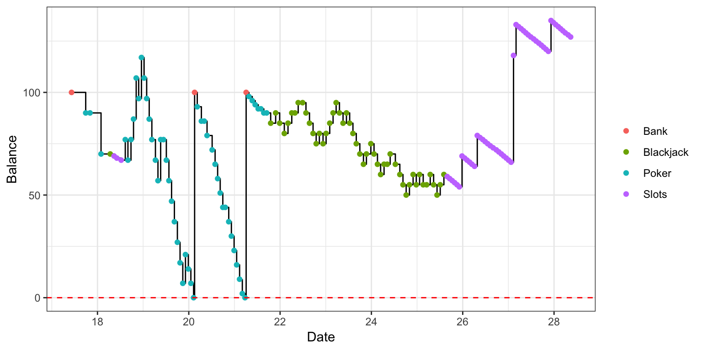

<!-- README.md is generated from README.Rmd. Please edit that file -->
casino 
==========================================================================

> Welcome to the casino, we've got fun and games
>
> We got everything you want and we know your name
>
> We are the people that can find whatever you may need
>
> And if you got no money, don't worry! You can play for free!

Overview
--------

Play casino games in the R console!

Installation
------------

``` r
# Install development version from GitHub
devtools::install_github("anthonypileggi/casino")
```

Quick Start
-----------

Use the `play()` function to start playing immediately. It provides a guided casino experience.

``` r
casino::play()
```

Create a Player
---------------

You can create a new player manually.

``` r
library(casino)

# Create a new player
Player$new(name = "Player 1")
#> Reseting profile for Player 1...
#> Player: 
#>   Name: Player 1
#>   Balance:  100
#>   Level:  0
#>   Played:  1
#>   Debt:  100

# View all available player profiles
players()
#> # A tibble: 1 x 2
#>   name     balance   
#>   <chr>    <chr>     
#> 1 Player 1 100.000000
```

Or just start playing, and one will automatically be created for you.

``` r
# Start a new game (this will auto-create a player)
Blackjack$new(who = "Player 2")
#> You have no money!
#> Blackjack (w/  1  decks): 
#> Player: Player 2
#> Bank: 100
#> Start a new game with `play()`.

# View all available player profiles (again)
players()
#> # A tibble: 2 x 2
#>   name     balance   
#>   <chr>    <chr>     
#> 1 Player 1 100.000000
#> 2 Player 2 100.000000
```

What is the `.casino` file?
---------------------------

A local `.casino` file will be created once you start playing, if it does not already exist. As you play, your profile will be stored in `.casino`. This file keeps track of your current balance and playing history between games and R sessions. Default behavior is to store and look for `.casino` in your working directory.

Play Casino Games
-----------------

Now it's time to head off to the casino! What should we play first?

### Poker (5-card stud)

``` r
x <- Poker$new(who = "Player 1", type = "stud", bet = 10)
#> Loading player profile...

# play a game
x$play()
#> You bet 10; you have 90 left.
#>  Hand: K ♣, 10 ♠, 10 ♣, 3 ♥, 6 ♦
#>  Result: one pair
#>    You lost -10!
#>    Now you have 90 in your account.
#> Do you want to `play()` again?

# specify a different bet for this game
x$play(bet = 5)
#> You bet 5; you have 85 left.
#>  Hand: A ♠, 8 ♣, 8 ♦, 4 ♦, 10 ♥
#>  Result: one pair
#>    You lost -5!
#>    Now you have 85 in your account.
#> Do you want to `play()` again?
```

### Poker (5-card draw)

``` r
x <- Poker$new(who = "Player 1", type = "draw", bet = 20)
#> Loading player profile...

# play a game
x$play()
#> You bet 20; you have 65 left.
#>  Hand: 3 ♥, 3 ♠, 10 ♦, Q ♠, K ♣
#> Choose cards to `hold()`` and then `draw()`.

x$hold(1, 2, 5)    # hold cards in positions {1, 2, 5}
#>  Hand: 3 ♥, 3 ♠, 10 ♦, Q ♠, K ♣
#> Choose cards to `hold()`` and then `draw()`.

x$draw()           # draw new cards for positions {3, 4}
#>  Hand: 3 ♥, 3 ♠, K ♣, 9 ♦, 5 ♣
#>  Result: one pair
#>    You lost -20!
#>    Now you have 65 in your account.
#> Do you want to `play()` again?
```

### Blackjack

``` r
x <- Blackjack$new(who = "Player 1", bet = 25)
#> Loading player profile...

x$play()$stand()
#> You bet 25; you have 40 left.
#>  Player Hand: {10, 6} = 16
#>  Dealer Hand: {?, 7} = ?
#> Will you `hit()` or `stand()`?
#> Game over! dealer wins
#>   You lost -25!
#>   Now you have 40 in your account.
```

### Slot Machine

``` r
x <- Slots$new(who = "Player 1", bet = 1)
#> Loading player profile...

x$play()
#> You bet 1; you have 39 left.
#>  Reels: * % *
#>    You lost -1!
#>    Now you have 39 in your account.
#> Do you want to `play()` again?

# set the `spins` argument to play > 1 game at a time
x$play(spins = 2)
#> You bet 1; you have 38 left.
#>  Reels: * & %
#>    You lost -1!
#>    Now you have 38 in your account.
#> You bet 1; you have 37 left.
#>  Reels: * ^ *
#>    You lost -1!
#>    Now you have 37 in your account.
#> Do you want to `play()` again?
```

I think I have a gambling problem
---------------------------------

If you want to play a lot of games, you can write a script.
Just make sure to silence the output (`verbose = FALSE`) and sounds (`sound = FALSE`).

``` r
# poker (stud)
x <- Poker$new(who = "Player 1", type = "stud", bet = 10, verbose = FALSE, sound = FALSE)
#> Loading player profile...
for (i in 1:50) 
  suppressMessages(x$play())

# blackjack (blind)
x <- Blackjack$new(who = "Player 1", bet = 5, verbose = FALSE, sound = FALSE)
#> Loading player profile...
for (i in 1:50) {
  suppressMessages(x$play())
  if (x$active)
    x$stand()
}

# penny slots
x <- Slots$new(who = "Player 1", bet = 1, verbose = FALSE, sound = FALSE)
#> Loading player profile...
suppressMessages(x$play(spins = 50))
#> Do you want to `play()` again?
```

Ok, now I lost everything...
----------------------------

If you run out of money, the Bank will immediately loan you 100. You're welcome!

Wait, how much did you say I owe?
---------------------------------

``` r
# player profile is stored in `$who` of a game object
player <- x$who

player$debt()
#> [1] 300
```

It's closing time...
--------------------

What a fun day at the casino! Or, was it?

``` r
# player profile is stored in `$who` of a game object
player <- x$who

# Overall
player$summary()
#> # A tibble: 1 x 4
#>   games   bet   win   net
#>   <int> <dbl> <dbl> <dbl>
#> 1   157   719   507  -212

# By Game
player$summary(game)  
#> # A tibble: 3 x 5
#>   game      games   bet   win   net
#>   <chr>     <int> <dbl> <dbl> <dbl>
#> 1 Blackjack    51   275   175  -100
#> 2 Poker        53   391   215  -176
#> 3 Slots        53    53   117    64
```

And don't worry if your memory is failing you, because we record everything...

``` r
player$plot()
```



Well, I guess we'll you'll be back tomorrow. See you then!
